# VCC
<!-- 
Click <a href="https://index-daddy372466.github.io/VCC/">here</a> to access your project!
## Updates

### 2025.11.05
<ol>
<li>
Images added to the project.  
<em>Path: /media</em>
</li>
<li>
Background color | Profile Image
</li>
<li>
Navigation placement | Navigation Hamburger menu (View on mobile device)
<em>Links are not operational</em>
</li>
</ol>

## Proof of Development

<h3>Desktop</h3>
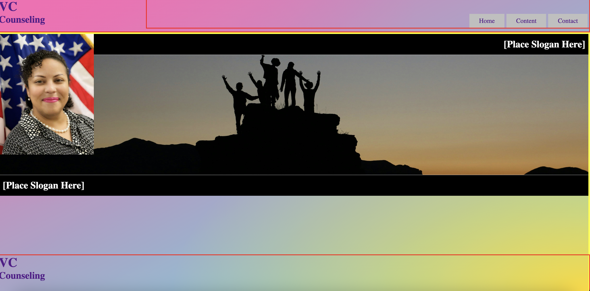

<h3>Tablet</h3>
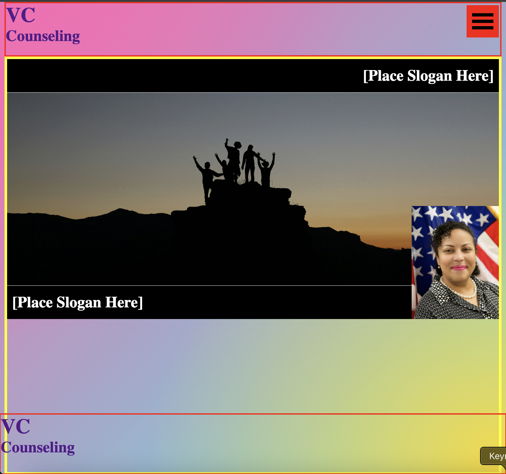

<h3>Mobile Landscape</h3>
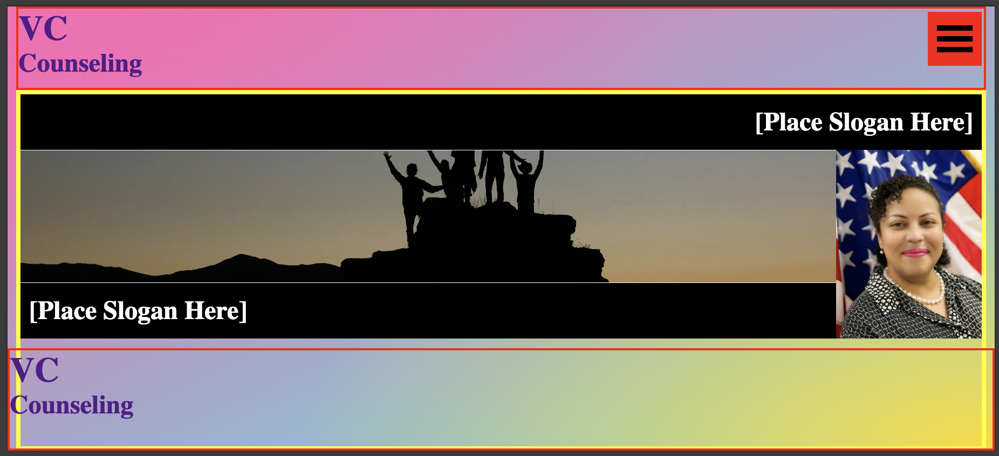

<h3>Mobile Portrait</h3>
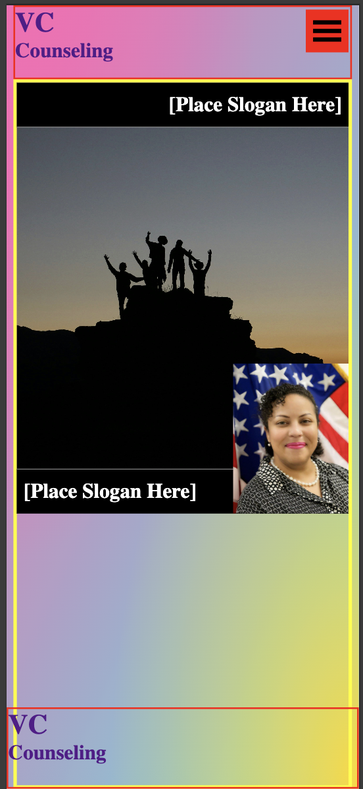

___________
Click <a href="https://index-daddy372466.github.io/VCC/">here</a> to access your project!

### 2025.11.06

## Slogan

"Empowering individuals with disabilities to discover their strengths, build meaningful careers, and create lasting value in the workplace." -->

## 2025.11.13 Updates

1. Problem section 
- text and subheaders added

## Instruction
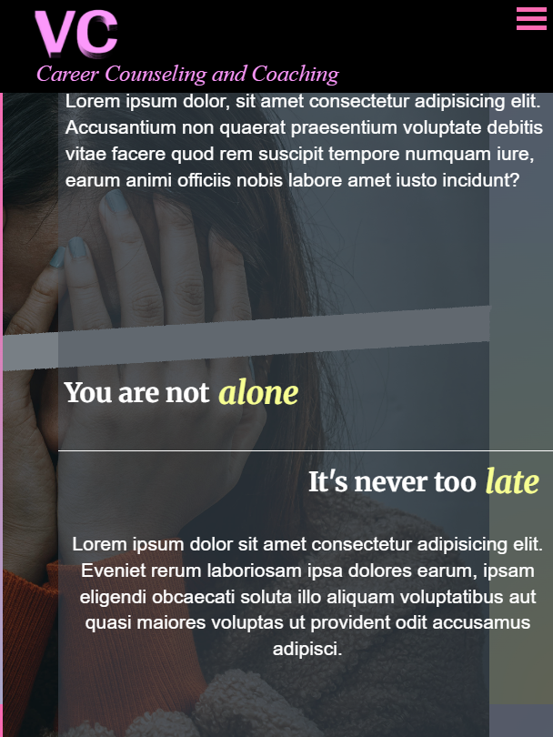

1. Access the <a href="https://github.com/index-daddy372466/VCC/tree/certification">VCC Repository</a>
2. <a style="text-decoration:none" href=https://github.com/index-daddy372466/VCC/blob/certification/index.html><em style="border-bottom:.5px solid red;">click here</em></a> to access the main html file, <em>index.html</em>
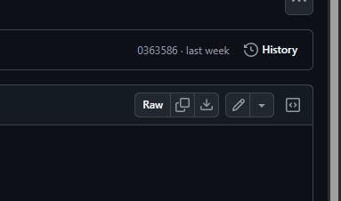

3. Edit file by clicking the pencil icon.

4. Edit text within the indicated field "Edit text below/above"
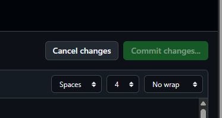

5. Save changes by clicking "Commit changes"

6. Cancel changes by clicking "Cancel changes"
 

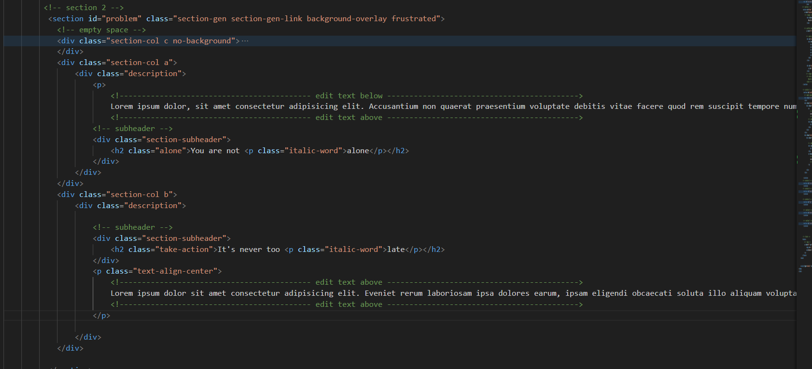

_______________

## 2025.11.14 Updates

1. Services updated
1. FAQ template ready for editing
1. FAQ - Toggle function to revel answers relative to the question above

## Instruction
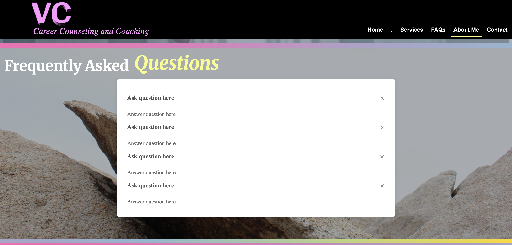

1. Access the <a href="https://github.com/index-daddy372466/VCC/tree/certification">VCC Repository</a>
2. <a style="text-decoration:none" href=https://github.com/index-daddy372466/VCC/blob/certification/index.html><em style="border-bottom:.5px solid red;">click here</em></a> to access the main html file, <em>index.html</em>

3. Edit file by clicking the pencil icon.

4. Edit text within the indicated field "Edit text below/above"

5. Save changes by clicking "Commit changes"

6. Cancel changes by clicking "Cancel changes"
 

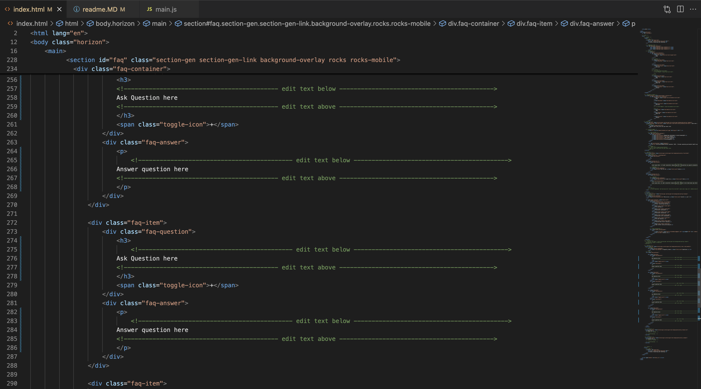

## 2025.11.14 9:40pm Updates

1. About me template ready for editing
1. FAQ section retired and fused with services
1. problem "cover-phrase" moved to about me

## Instruction

1. Access the <a href="https://github.com/index-daddy372466/VCC/tree/certification">VCC Repository</a>
2. <a style="text-decoration:none" href=https://github.com/index-daddy372466/VCC/blob/certification/index.html><em style="border-bottom:.5px solid red;">click here</em></a> to access the main html file, <em>index.html</em>

3. Edit file by clicking the pencil icon.

4. Edit text within the indicated field "Edit text below/above"

5. Save changes by clicking "Commit changes"

6. Cancel changes by clicking "Cancel changes"
 

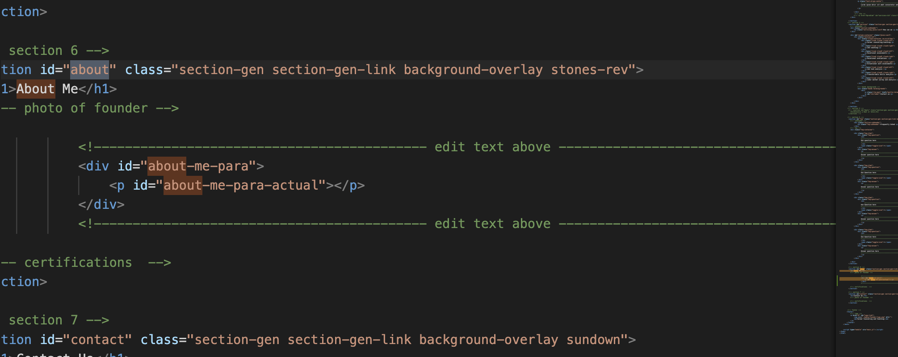