# VCC

<!--
Click <a href="https://index-daddy372466.github.io/VCC/">here</a> to access your project!
## Updates

### 2025.11.05
<ol>
<li>
Images added to the project. <br>
<em>Path: /media</em>
</li>
<li>
Background color | Profile Image
</li>
<li>
Navigation placement | Navigation Hamburger menu (View on mobile device)
<em>Links are not operational</em>
</li>
</ol>


## Proof of Development
<div>
<h3>Desktop</h3>
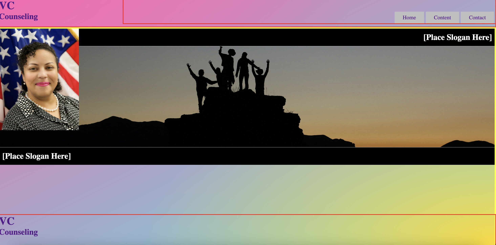
</div>
<div>
<h3>Tablet</h3>
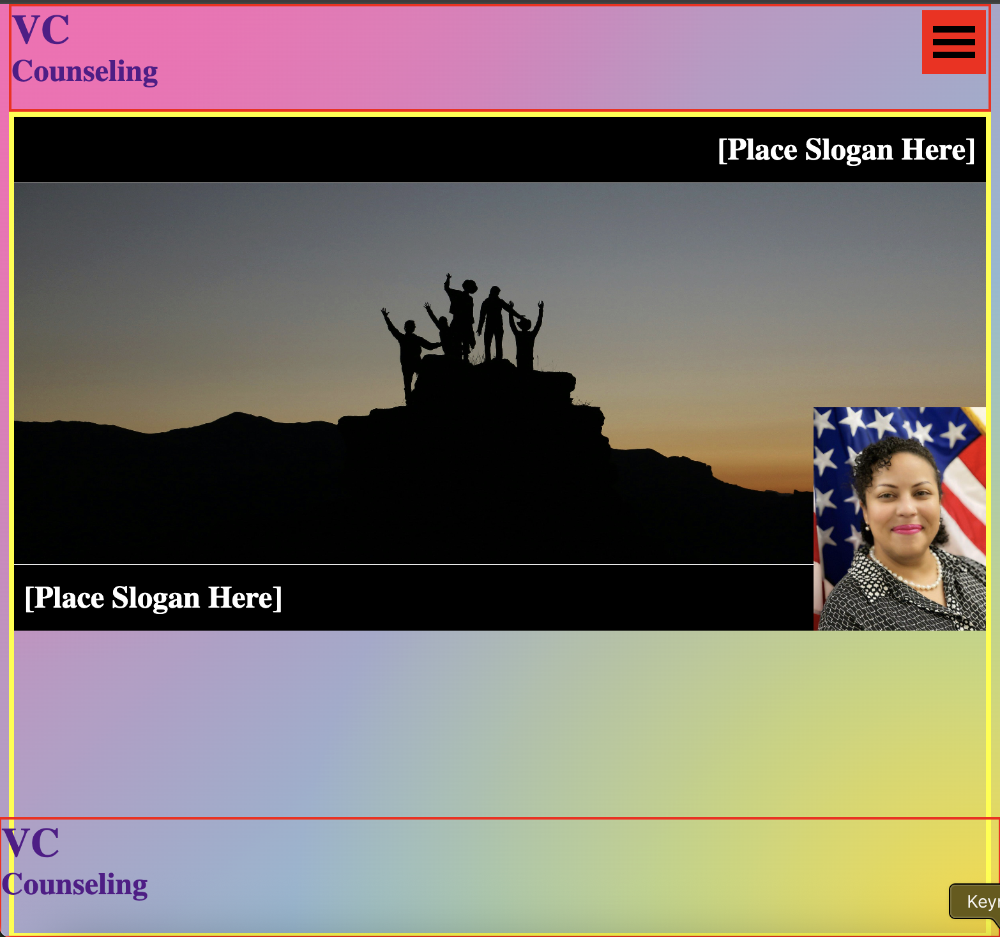
</div>
<div>
<h3>Mobile Landscape</h3>
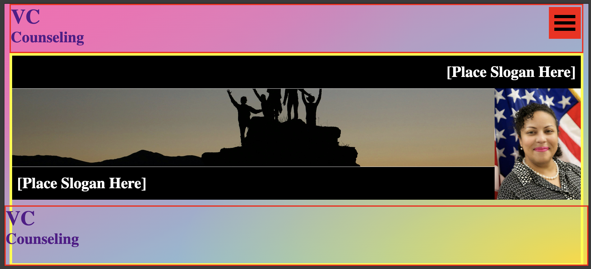
</div>
<div>
<h3>Mobile Portrait</h3>
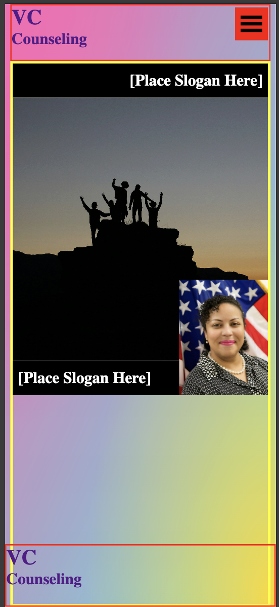
</div>

___________
Click <a href="https://index-daddy372466.github.io/VCC/">here</a> to access your project!


### 2025.11.06

## Slogan

"Empowering individuals with disabilities to discover their strengths, build meaningful careers, and create lasting value in the workplace." -->

<!-- ## 2025.11.13 Updates

1. Problem section
- text and subheaders added

## Instruction
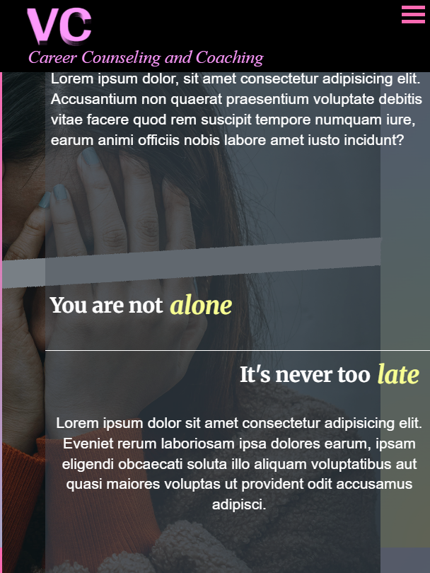

1. Access the <a href="https://github.com/index-daddy372466/VCC/tree/certification">VCC Repository</a>
2. <a style="text-decoration:none" href=https://github.com/index-daddy372466/VCC/blob/certification/index.html><em style="border-bottom:.5px solid red;">click here</em></a> to access the main html file, <em>index.html</em>
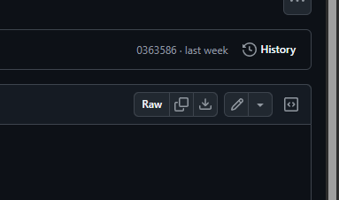

3. Edit file by clicking the pencil icon.

4. Edit text within the indicated field "Edit text below/above"
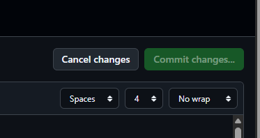

5. Save changes by clicking "Commit changes"

6. Cancel changes by clicking "Cancel changes"
<br>

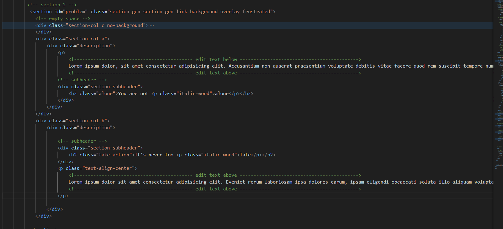

_______________

## 2025.11.14 Updates

1. Services updated
1. FAQ template ready for editing
1. FAQ - Toggle function to revel answers relative to the question above

## Instruction
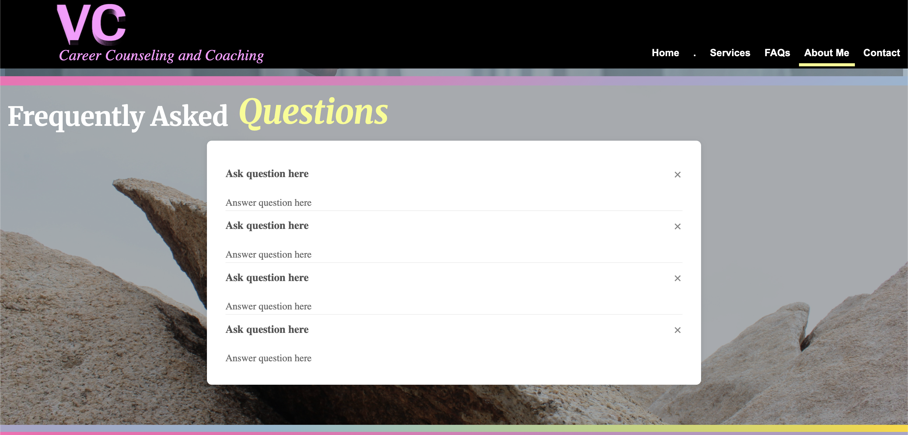


1. Access the <a href="https://github.com/index-daddy372466/VCC/tree/certification">VCC Repository</a>
2. <a style="text-decoration:none" href=https://github.com/index-daddy372466/VCC/blob/certification/index.html><em style="border-bottom:.5px solid red;">click here</em></a> to access the main html file, <em>index.html</em>


3. Edit file by clicking the pencil icon.

4. Edit text within the indicated field "Edit text below/above"


5. Save changes by clicking "Commit changes"

6. Cancel changes by clicking "Cancel changes"
<br>

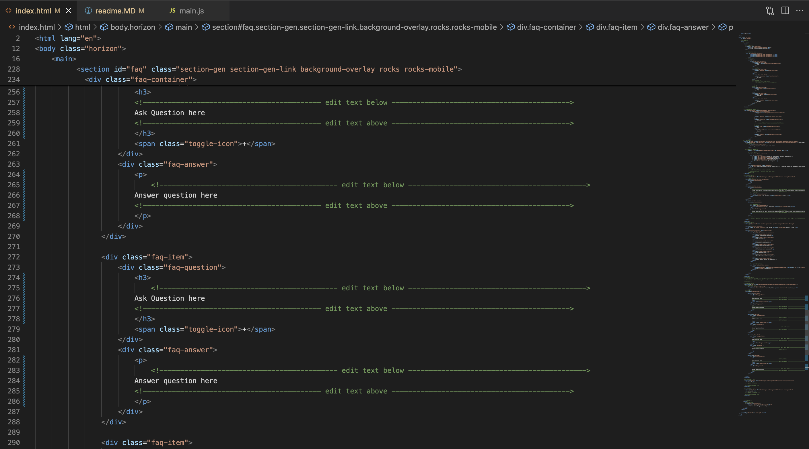

## 2025.11.14 9:40pm Updates

1. About me template ready for editing
1. FAQ section retired and fused with services
1. problem "cover-phrase" moved to about me

## Instruction

1. Access the <a href="https://github.com/index-daddy372466/VCC/tree/certification">VCC Repository</a>
2. <a style="text-decoration:none" href=https://github.com/index-daddy372466/VCC/blob/certification/index.html><em style="border-bottom:.5px solid red;">click here</em></a> to access the main html file, <em>index.html</em>


3. Edit file by clicking the pencil icon.

4. Edit text within the indicated field "Edit text below/above"


5. Save changes by clicking "Commit changes"

6. Cancel changes by clicking "Cancel changes"
<br>

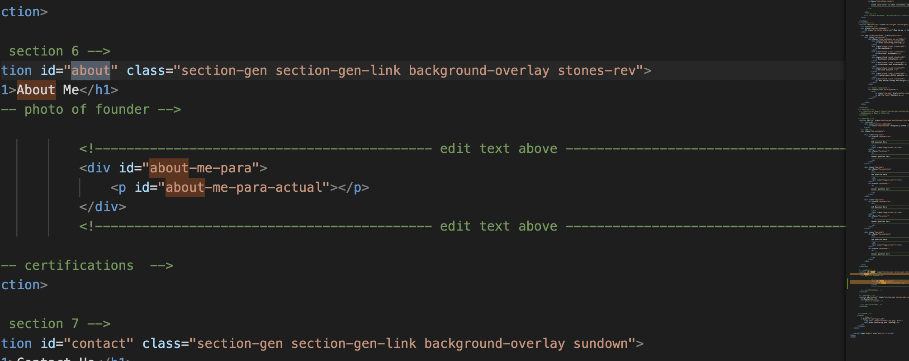 -->

<!-- ## Youre site is on it's way!

## 2025.11.19 Updates

1. section backgrounds updated
1. VC logo updated
1. padding on both ends of the site should allow user to scroll without getting stuck in 1 section
1. contact template updated
1. mobile and desktop compatability enhanced

## Instruction

1. Access the <a href="https://github.com/index-daddy372466/VCC/tree/certification">VCC Repository</a>
2. <a style="text-decoration:none" href=https://github.com/index-daddy372466/VCC/blob/certification/index.html><em style="border-bottom:.5px solid red;">click here</em></a> to access the main html file, <em>index.html</em>
   

3. Edit file by clicking the pencil icon.

4. Edit text within the indicated field "Edit text below/above"
   

5. Save changes by clicking "Commit changes"

6. Cancel changes by clicking "Cancel changes"
   <br>

 -->


# Search Engine Optimization

## 2025.12.07

1. What are Meta Tags?
Meta tags are HTML code snippets placed in the <head> section of a web page that provide information to browsers and search engines, such as the page's description and keywords. They are invisible to site visitors but are crucial for SEO and social media, as they help search engines understand and rank content, and influence how a page is displayed in search results and on social media platforms. 

2. How can this work for my site?
Meta tags function by providing metadata about an HTML document, which is data about data, to browsers, search engines, and other web services. These tags are placed within the <head> section of an HTML document and are not visible on the webpage itself but are read by machines.

3. Can I see my Meta tags?

   Your updated meta can be accessed in the __index.html__ file, or view below.

   ```
    <meta name="author" content="Leland Bassie">

    <meta name="description" content="Seeking a Certified Rehabilitation Counselor in West Palm Beach? We offer specialized counseling for trauma, disability, and career recovery. Start your journey to healing. Call now">

    <meta name="robots" content="follow, max-image-preview:large, max-snippet:-1, max-video-preview:-1">
    
    ```

   __Key Take Aways__:

   <em>name = "robots"</em>

   <em>[max-image-preview:large, max-snippet:-1, max-video-preview:-1]</em>

   This will help you improve your website’s appearance on Google Discover.

   This rule instructs Google to display large image previews, unlimited text snippets, and full-length video previews in search results, which can greatly help improve your CTR in Discover.


